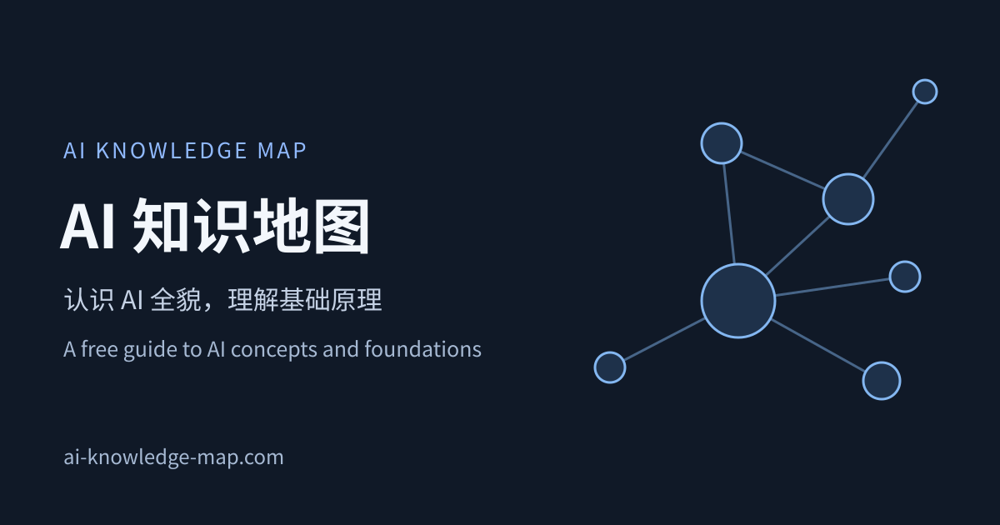

# AI Knowledge Map · AI 知识地图

**Learn how AI concepts fit together — 130 concepts, 416 connections, and a 9-stage learning path.**

**看懂 AI 概念之间的关系：130 个概念、416 条关联、9 个学习阶段。**

[**Explore in English →**](https://ai-knowledge-map.com/?lang=en) · [**中文在线体验 →**](https://ai-knowledge-map.com/?lang=zh-Hans) · [Report an issue / 反馈问题](https://github.com/Little-FishK/AI-knowledge-map/issues)

Free to read in your browser. No account is required to explore the map or read concept explainers.

免费在线阅读。浏览地图和概念讲解无需注册账号。

[](https://ai-knowledge-map.com/)

## English


AI Knowledge Map is an interactive learning resource for people starting with AI and developers connecting the ideas behind modern AI systems. Explore a concept, see how it relates to other ideas, then follow a learning path from foundations to LLMs, RAG, agents, and safety.

### What you can explore

- **An interactive concept map:** 130 concepts connected by 416 typed relationships, with search, filters, and a focused core view.
- **A 9-stage learning path:** a suggested order for working through the concepts without having to plan your own syllabus.
- **Concept explainers:** Chinese and English explanations for topics such as neural networks, Transformers, tokens, RAG, AI agents, and MCP.
- **Learning progress:** mark concepts as learned and keep track of what to explore next.
- **Further learning resources:** a software directory, tutorials, and a reference library. Some supporting resources are currently available only in Chinese.

### Start in three steps

1. [Open the English map](https://ai-knowledge-map.com/?lang=en) and start with the core view.
2. Turn on **Recommended path** to follow the nine learning stages, or search for a term you have just encountered.
3. Open a concept, read its explanation, and explore the related concepts before marking it as learned.

You can browse without signing in. Guest progress is stored in your browser; clearing browser data removes it. The live website also offers optional account-based progress sync, which requires an internet connection.

## 中文

AI 知识地图面向刚接触 AI 的学习者，以及希望把零散知识串起来的开发者。你可以从一个听过但不理解的词开始，也可以按推荐路线逐步学习，理解基础概念、大模型、RAG、Agent 和安全问题之间的联系。

### 你可以在这里做什么

- **看关系：** 130 个概念通过 416 条有方向、有类型的关系连接起来，支持搜索、筛选和核心视图。
- **找顺序：** 按 9 个阶段的推荐学习路径，逐步决定先学什么、后学什么。
- **理解原理：** 阅读中英文概念讲解，覆盖神经网络、Transformer、Token、RAG、AI Agent、MCP 等主题。
- **记录进度：** 标记已学习概念，查看接下来可以学习的内容。
- **继续探索：** 查阅软件目录、使用教程和专业资料库；部分配套资源目前仅提供中文。

### 三步开始

1. [打开中文地图](https://ai-knowledge-map.com/?lang=zh-Hans)，先从核心视图建立整体印象。
2. 开启“推荐学习路径”，或直接搜索刚听到的术语。
3. 打开概念、阅读讲解、查看相关概念，再标记为已学习。

无需登录即可浏览。访客进度保存在当前浏览器，清除浏览器数据后会丢失；线上网站也提供可选的账号与跨设备进度同步，需要联网使用。

## Feedback and contributions / 反馈与参与

Found an unclear explanation, a factual error, a broken link, or a translation problem? [Open an issue](https://github.com/Little-FishK/AI-knowledge-map/issues) with the page URL, the passage or behavior involved, and a suggested correction or source where possible.

欢迎反馈讲解不清、事实错误、失效链接、翻译问题或使用障碍。请附页面网址、具体段落或复现步骤，以及可供核对的来源或修改建议。

The material is under continuous revision. Coverage does not mean every page has passed all quality reviews. Contributions to concept explainers follow the project's [content review workflow](docs/DEEPDIVE_STAGE2_AUTOMATION.md) and [source policy](docs/SOURCE_POLICY.md).

内容持续维护与修订中，页面覆盖不等于全部通过质量审核。概念讲解的修改遵循项目的内容审核流程与来源要求。

## License / 许可

- **Original code:** [MIT](LICENSE).
- **Original articles and explanatory figures owned by this project:** [CC BY 4.0](https://creativecommons.org/licenses/by/4.0/). Credit **LittleFishK / AI Knowledge Map**, link the source and license, and indicate changes.
- **Third-party materials:** retain their respective licenses; see [CREDITS.md](CREDITS.md).

原创代码采用 MIT；项目拥有权利的原创文章和讲解图表采用 CC BY 4.0。第三方素材遵守各自许可。完整范围见 [CONTENT_LICENSE.md](CONTENT_LICENSE.md)。

---

## 本地开发与维护说明

文档入口：[分类索引](docs/README.md) · [源码、运行时与发布边界](docs/REPOSITORY_LAYOUT.md) · [工具目录](tools/README.md)。历史发布记录已集中到 `docs/archive/`。

一个可离线打开的 AI 学习知识网：用有方向、有类型的关系连接概念，并把概念原理、软件目录、专业资料库、使用教程和学习进度放在同一个静态网站里。

> 正式网站：[ai-knowledge-map.com](https://ai-knowledge-map.com/)。本文运行说明于 2026-09-20 核对。阶段记录见 [docs/WEBSITE_MATURITY_PROGRESS.md](docs/WEBSITE_MATURITY_PROGRESS.md)；其中的阶段日期和 [docs/STATUS.md](docs/STATUS.md) 属于历史记录，不代表当前部署版本。内容覆盖不等于教学质量认证。

## 当前内容

- 130 个概念节点、416 条关系边、6 个用途大区
- 130/130 个节点已覆盖“理解原理”页；各页审核状态以控制器记录为准，覆盖不代表教学质量门禁通过
- 62 个软件条目、11 个软件门类
- 4 个使用教程页、22 条正式视频资源
- 9 类一级来源、73 个二级来源与73份平台档案、98 条专业资料（其中官方技术资料 90 条）
- 覆盖全部节点的 9 层官方推荐学习路径
- 本地“已学习”状态记录、搜索、过滤、聚焦与自动防重叠排布

## 使用

本机查看与正式网站一致的版本，请双击 `启动网站.cmd`。它只在 `127.0.0.1` 启动服务，加载部署基线所指向、通过校验的完整发布副本，包含中英文理解页。需要 Node.js；没有本机发布副本时会明确报错，不会悄悄回退到源码版。

直接双击根目录 `index.html` 是源码离线预览：可以浏览地图和中文内容，但 `file://` 模式不加载英文 JSON，也不等同于完整发布版；它显示的内容工作流提示可能与正式站不同。它还依赖 `assets/`、`data/` 等本地资源，不能只下载一个 HTML 文件运行。

访客学习进度保存在浏览器本地存储中；清除浏览器数据会清除本地进度。网站也提供账号和跨设备同步：登录后通过 Supabase Auth 与数据库同步学习进度。登录、云同步和账号删除需要网络，离线浏览不等于这些在线功能可用。不同浏览器、`file://` 和正式网站的存储相互独立。

账号前端位于 `assets/progress-*.js`，数据库迁移位于 `supabase/migrations/`，账号删除服务位于 `supabase/functions/delete-account/`。部署自己的实例时，需要配置相应服务；说明见 [docs/operations/PHASE7_ACCOUNTS.md](docs/operations/PHASE7_ACCOUNTS.md)。

页面使用离线兼容的 Hash URL：理解原理页、软件、教程和资料详情会更新地址栏。普通地图节点详情属于临时探索状态，不改变网址；复制完整地址即可分享或收藏真正的内容页，刷新以及浏览器前进、后退也会恢复对应视图。

地图支持 `#/map/supervised-learning` 一类节点定位地址，供独立内容页链接回地图；从这种地址进入后，选择其他节点会同步更新定位地址，关闭节点详情则返回 `#/map`。`?lang=en#/map/supervised-learning` 可直接进入英文地图。正式网站同时提供 `/zh/concepts/<id>/` 和 `/en/concepts/<id>/` 独立内容页，导航根据所选语言进入对应页面。

## 构建与部署

源码离线运行与发布构建是两种不同的使用方式。开发检查需要 Node.js 22 和项目依赖；发布还需生成独立内容页、搜索和清单等产物：

```bash
npm run build:website
npm run build:website:production
```

前者生成预览，后者请求正式发布构建；这些命令通过 Stage 2 MCP 控制器执行，并返回构建目录和状态，构建本身不等于上线。正式构建仍受内容审核和发布门禁约束。

`site-release/` 是仓库内的发布产物目录，不能仅凭目录名认定它与线上一致。当前翻译部署基线由 `.tmp/translation-deployments/baseline.json` 指向，正式部署以 `gh-pages` 提交及上线验证回执为准。维护规则见 [docs/WORKSPACE_MAINTENANCE.md](docs/WORKSPACE_MAINTENANCE.md)。

地图页脚的版本和日期来自图谱数据元信息，只表示图谱数据版本，不表示网站代码版本或最近部署时间。

## 前端结构

前端继续使用按顺序加载的普通脚本，以保持 `file://` 离线兼容。`assets/app.js` 只负责模块组装、顶级视图切换和 URL 路由应用；各功能位于 `assets/app/`：

- `graph-view.js`：地图、筛选、缩放、搜索和普通节点详情
- `learning-view.js`：学习进度与推荐路径
- `deepdive-view.js`：理解原理页
- `software-view.js`：软件目录、软件详情和教程
- `library-view.js`：专业资料库
- `runtime-loader.js`：理解原理页按需加载
- `shared.js`：转义、轻量 Markdown、防抖和脚本加载等公共工具

模块通过工厂函数和显式参数连接，不直接互相控制；页面导航统一由 `assets/app.js` 协调。

多语言改造的语言合同、翻译边界和源内容基线见 [docs/I18N.md](docs/I18N.md)，统一中英名称及审核流程见 [docs/TERMINOLOGY.md](docs/TERMINOLOGY.md)。英文图谱大区、关系类型、全部 130 个节点及官方学习顺序的九个阶段均已发布。130 个理解原理页的英文版已上线；软件、教程、资料库等没有英文记录的内容仍按完整记录回退为中文。

## 质量检查

需要 Node.js 22。首次运行浏览器审计前安装依赖：

```bash
npm install
npx playwright install chromium
```

运行数据、引用、布局、软件和教程校验：

```bash
npm run validate
```

运行包括理解原理页 L1/L2/L3、浏览器与 WCAG 审计在内的完整门禁：

```bash
npm run quality:all
```

Windows PowerShell 若阻止 `npm.ps1`，可将命令中的 `npm` 改为 `npm.cmd`。

## 视频双轨入库

同一份视频证据仍走教程与概念两条独立提案。教程轨写软件目录和使用教程；概念轨只负责判断已有节点补充、新节点、合并或不收录。已有节点补充与新节点事实包会进入理解原理页第二阶段，旧视频流程不再自行生成或发布理解原理页。

完整命令、评分和数据合同见 [docs/VIDEO_INGEST.md](docs/VIDEO_INGEST.md)。

## 理解原理页第二阶段

130 个已有页面从独立审计开始，只有真正的新节点从零写作。系统串行执行 `audit / update / write / repair`，每次 Codex 定时任务只处理一页的一个阶段；候选内容通过机械门禁后才由控制器原子发布。运行方式、材料隔离、三页试点和视频双轨边界见 [docs/DEEPDIVE_STAGE2_AUTOMATION.md](docs/DEEPDIVE_STAGE2_AUTOMATION.md)。

```bash
npm run stage2:status
```

## 内容与来源

正文采用原创表达；外部资料用于选题、事实核对和继续阅读，具体来源与第三方许可说明见 [CREDITS.md](CREDITS.md)。专业资料库的数据结构见 [docs/LIBRARY.md](docs/LIBRARY.md)，来源白名单与证据边界见 [docs/SOURCE_POLICY.md](docs/SOURCE_POLICY.md)，教程资源的收录标准见 [docs/TUTORIALS.md](docs/TUTORIALS.md)。


## 许可 / Licensing

原创代码采用 [MIT](LICENSE)，原创文章及自有原创讲解图表采用 [CC BY 4.0](https://creativecommons.org/licenses/by/4.0/)。署名：LittleFishK / AI 知识地图。第三方素材遵守各自许可；完整范围见 [内容与代码许可说明](CONTENT_LICENSE.md)。
