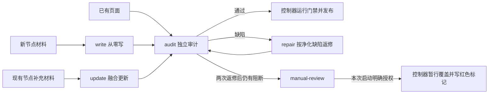
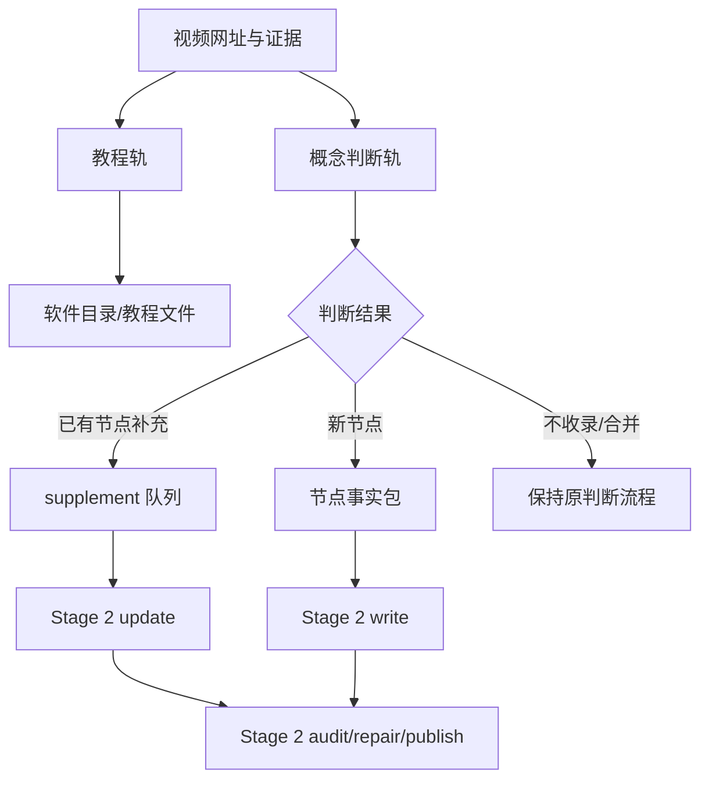

# 理解原理页第二阶段：串行隔离自动化

## 1. 结论

第二阶段不是同时常驻六个 Agent，也不是把 130 页重新写一遍。系统每次只启动一个全新 Codex 任务，只处理一页的一个阶段：



定时任务每次只做一个方框，然后结束。下一次运行会创建新对话，因此不同阶段不继承上一次的聊天上下文。

## 2. 系统位置

| 部件 | 位置 | 责任 |
|---|---|---|
| 调度器/状态机 | `tools/deepdive-stage2/core.js` | 决定下一项任务、租约、状态转换、失败恢复和发布 |
| 命令入口 | `tools/run-deepdive-stage2.js` | 初始化、暂停、恢复、查看状态和人工诊断 |
| Codex 窄接口 | `tools/deepdive-stage2/mcp-server.js` | 只暴露状态、领取一项任务、提交一项结果 |
| 运行状态 | `.stage2/state.json` | 130 页与新节点的唯一进度事实源 |
| 私有结果 | `.stage2/results/` | 候选页、私有审计与发布回执；不进 Git |
| 事件日志 | `.stage2/events.jsonl` | 只追加的运行轨迹；不进 Git |
| 写作政策 | `.stage2/policies/writing-policy.md` | 写作者可见的稳定要求，不含审计答案 |
| 定时触发器 | Codex 桌面应用的自动化 | 定时创建一个全新、无项目对话并调用窄接口 |

调度器放在仓库里，因为它必须与数据结构、门禁和版本一起演进；定时器放在 Codex 桌面应用里，因为它只负责按时唤醒，不持有业务状态。

## 3. 状态机

页面状态如下：

| 状态 | 下一角色 | 说明 |
|---|---|---|
| `audit-queued` | audit | 已有页面或新候选页等待独立检查 |
| `auditing` | audit | 已被一个运行实例租用 |
| `update-queued` | update | 已有页面收到新材料，需融合进原教学过程 |
| `updating` | update | 更新任务执行中 |
| `write-queued` | write | 只有新节点从零写作 |
| `writing` | write | 新页面写作中 |
| `repair-queued` | repair | 审计发现缺陷，等待返修 |
| `repairing` | repair | 返修执行中 |
| `manual-review` | 控制器收尾 / 人工 | 两次返修仍失败或发生不可自动处理的问题；按本次启动的必选策略暂行发布或保持待人工 |
| `l3-auto-passed` | 无 | 内容哈希绑定的自动门禁已通过并正式发布 |

工作流状态与发布状态彼此独立。控制器启动器要求每次显式选择 `manual-review` 的处理策略：`publish-provisional` 或 `hold`，没有默认值。选择前者表示本次页面已获得用户授权；MCP 才会临时开放绑定到该页的暂行发布工具。控制器以 `published-provisional` 暂行覆盖正式页后，工作流仍保持 `manual-review`，不产生 L3 Pass；界面使用红色标题和“未通过审计 · 暂行版本”文字标记。选择 `hold` 时发布工具不会暴露，控制器只报告候选和阻断项。真正通过门禁后，控制器发布无暂行标记的正文，并把发布状态改为 `published-approved`。

领取优先级是 `repair > update > write > audit`。这样新材料和返修不会长期被 126 个存量审计淹没。

全局同时最多只有一个租约。租约默认 45 分钟；任务异常退出后，过期租约自动回队。每页最多自动返修两次，避免无限循环。

审计提交先验证审计合同。合同、证据定位或 schema 无效时，本次审计以 `rejected` 结束，页面回到 `audit-queued` 交给新的独立审计；这不计入正文返修次数，也不会把审计格式问题下发给 repair。只有合同有效的正文阻断项和控制器直接检出的正文阻断项才进入 `repair-queued`。

## 4. 三种内容 Agent 与一个控制器

这里的“Agent”是角色，不是三个一直打开的窗口：

1. **写作角色**：`write` 只处理新节点；`update` 只处理现有页的新材料；`repair` 只按净化后的缺陷重写。三者共用写作政策，但每次都是全新对话。
2. **审计角色**：只判断候选页是否真实回答六问、教学链是否连贯，并给出定位明确的缺陷；不改正文。
3. **控制器**：不创作内容。它持有状态、隐藏私有审计、运行机械门禁、执行原子发布和失败回滚。

返修者不会拿到审计者的完整答案，只会收到控制器净化后的缺陷，包括位置、缺失能力、失败表现和验收条件。这样它知道哪里要修，却不能照抄审计措辞来“对答案”。

## 5. 每种任务能看到什么

| 角色 | 可见 | 不可见 |
|---|---|---|
| audit | 当前候选页、六问审计合同；通过租约绑定的 MCP 只读检查项目文本、页面来源和门禁实现 | 写作者对话、私有外置审计、状态文件、Git、依赖、密钥；任何直接写入 |
| write | 新节点事实材料、关系与学习路径、来源、写作政策 | 审计答案、其他页面全文、整个项目 |
| update | 当前页面、只属于该页的新补充材料、写作政策 | 私有审计、无关视频材料、其他页面全文 |
| repair | 当前候选页、净化缺陷、写作政策 | 私有审计原文、门禁内部答案、其他页面全文 |

隔离采用“硬边界 + 软边界”：

- 硬边界：无项目定时任务、租约绑定的 MCP 工具、官方文件只由控制器写、私有审计不下发、哈希绑定、原子回滚。audit 的项目访问由只读 MCP 执行，接口没有写入能力；write/update/repair 不能调用。
- 软边界：提示词要求 Agent 不寻找额外材料、不领取第二项任务，并允许写作风格在政策范围内自由变化。

这比只靠提示词可靠，也比为每页建立独立操作系统沙箱轻得多。它不是绝对的安全隔离；它是针对本地内容生产的材料隔离和发布权限隔离。

## 6. 如何发任务

Codex 定时任务使用 MCP 接口：

1. 调用 `stage2_claim_task`。
2. 若返回 `paused`、`busy` 或 `idle`，立即结束。
3. 若返回任务包，只完成其中指定的 `role`。
4. 调用一次 `stage2_submit_result`。
5. 内容 Agent 收到控制器结果后停止，不领取第二项任务。
6. 控制器只读检查该页提交后的工作流与发布状态；若进入 `manual-review`，执行启动时必选的 `publish-provisional` 或 `hold` 策略。
7. `publish-provisional` 策略必须使用检查接口刚返回的候选哈希，最多调用一次暂行发布，再复查发布状态为 `published-provisional`；不得改写为 L3 Pass。
8. 控制器确认收尾完成后，调用 Codex 任务归档工具归档当前任务并结束。

正常定时运行不传页面 ID，控制器按优先级领取。人工单页试点可以在 `stage2_claim_task` 中传入 `pageId`，但仍必须满足“全局无活动租约、页面处于可领取状态、一次运行只领取一项”。

受限 Codex 控制器的单阶段启动必须明确选择人工复核策略，例如：

```powershell
powershell -NoProfile -ExecutionPolicy Bypass -File tools/run-stage2-codex-controller.ps1 `
  -PageId rnn -StartOrder 2.7 `
  -ManualReviewAction publish-provisional `
  -ProvisionalReason "用户授权：最终受阻候选优于旧正式页，以红色暂行版本覆盖"
```

若该页不允许覆盖，必须显式传入 `-ManualReviewAction hold`。启动器没有默认策略，避免协调 Agent 忘记执行收尾步骤。若页面已经处于 `manual-review`，用 `publish-provisional` 再运行同一启动器时，控制器会直接检查并暂行发布，不会启动新的 audit/repair Agent。

audit 任务包还会提供 `stage2_search_project` 和 `stage2_read_project_file`：

- 两者必须携带当前 `taskId` 与 `leaseToken`，只有活动 audit 租约可以使用。
- 可以搜索和分段读取项目文本、门禁脚本、规范与页面来源；单次读取最多 400 行。
- 硬性拒绝 `.stage2/`、`docs/deepdive-audits/`、`.git/`、`node_modules/`、环境变量、凭据、密钥、二进制及超大文件。
- 读取其他材料是为了理解验收标准，不能用旧合同或其他页面代替当前页的独立判断。

归档只隐藏已完成的 Codex 任务记录，不删除 Stage 2 事件、哈希和回执。提交失败或需要用户处理时不自动归档，以便在界面中看到异常。

人工诊断命令：

```powershell
npm run stage2:status
npm run stage2:pause
npm run stage2:resume
```

初始化会扫描当前 130 页并导入待处理的视频补充：

```powershell
npm run stage2:init
```

除测试夹具外，不应使用 `--force` 重建真实状态；状态文件是进度事实源。

## 7. 视频双轨如何接入

输入网址后的前半段保持不变：



边界如下：

- 教程轨仍由原系统写教程，不进入 Stage 2。
- `supplement` 进入目标页面的 `update-queued`，不会从零重写。
- 真正的新节点先形成节点、关系、路径、证据与来源事实包，再运行：

```powershell
npm run video:stage2-enqueue-new -- `
  --proposal "<proposal.json>" `
  --evidence "<evidence.json>" `
  --assessment "<assessment.json>" `
  --packet "<content-packet.json>" `
  --content "<node-detail-content.json>"
```

- Stage 2 完成 `write → audit → 必要时 repair → 自动门禁` 后，控制器才把节点、关系、学习路径、核心身份和理解原理页作为一个原子变更发布。
- 旧的 `video:node-package` / `video:node-apply` 只保留兼容和回滚能力；没有 Stage 2 的内容哈希回执时，正式应用会被拒绝。

因此两个系统不会争写同一页面：旧系统负责“是否成为节点、事实材料是什么”，新系统独占“理解原理页如何写、如何审、何时发布”。

## 8. 发布与回滚

Agent 提交的内容只进入 `.stage2/results/`，不是正式页面。控制器随后：

1. 校验任务 ID、租约令牌、角色和页面 ID。
2. 把审计与候选页面分别保存，保持上下文隔离。
3. 在临时副本中运行 L1、Gold 结构审计与 L3 benchmark。
4. 通过后才写正式文件、官方审计和运行时清单。
5. 再运行全局数据、深读页、教程、视频应用和资料库验证。
6. 任一检查失败，恢复所有目标文件并把页面送入人工复核。

现有页面以末位覆盖文件发布，避免自动修改承载多个页面的共享批次源文件；新节点以原子集成包发布。

### 8.1 不合格候选的暂行发布

当两次返修后的页面仍有阻断项时，暂行发布是受限控制器流程中的正式收尾分支，而不是内容 Agent 的额外任务：

1. 最终 audit 提交后，状态机把页面置为 `manual-review`，审计 Agent 随即停止；
2. 启动器必须已经明确选择 `publish-provisional`，该选择作为本页发布授权，只临时开放控制器的暂行发布能力；
3. 控制器先只读检查候选，确认无活动租约、取得当前候选哈希、阻断项和 `canPublishProvisional=true`；
4. 控制器使用刚取得的精确候选哈希，最多调用一次暂行发布；哈希已变化时发布会拒绝，必须重新检查；
5. 控制器以原子覆盖方式发布带 `published-provisional` 元数据的候选，并再次检查发布状态；
6. 控制器保留被覆盖目标的私有快照，并运行结构、深读页与视频集成检查，但不会跳过状态记录去伪造 L3 Pass；
7. 页面继续保持 `manual-review`，标题显示红色，并同时显示文字警告和阻断项数量；
8. 目标文件若在发布后发生变化，回滚会拒绝覆盖，避免抹掉其他人的更新。

权限仍是硬隔离：controller profile 始终可做只读发布检查；只有启动器显式选择 `publish-provisional` 时，MCP 才暴露发布工具，而且服务端把检查和发布都锁定到本次 `STAGE2_MCP_PAGE_ID`。audit/repair profile 永远看不到该工具。

暂行发布只适用于已有理解原理页。尚未集成的新概念节点必须先通过正式门禁，不能借暂行发布写入图数据、学习路径或核心节点集合。

```powershell
node tools/run-deepdive-stage2.js inspect-publication <page-id>
node tools/run-deepdive-stage2.js publish-provisional <page-id> --hash <sha256:...> --reason "<人工授权原因>"
node tools/run-deepdive-stage2.js rollback-provisional <page-id> --hash <sha256:...> --reason "<回滚原因>"
```

## 9. 三页试点与正式启用

正式定时任务初始保持暂停。建议试点依次覆盖三种真实路径：

1. 一页无视频补充的存量页面：验证 `audit → pass` 或 `audit → repair`。
2. 一页已有视频补充的页面：验证 `update → audit`。
3. 一个经过批准的新节点：验证 `write → audit → 原子集成`。

每页检查：

- Agent 是否只收到该任务包；
- 是否只领取一次；
- 私有审计是否没有泄露给返修者；
- 候选内容是否在门禁前没有进入正式页面；
- 发布失败是否完整回滚；
- 事件日志与内容哈希是否能复盘。

三页均通过后，先恢复 Stage 2，再启用 Codex 定时任务。暂停只停止领取新任务，不删除状态，也不影响已发布内容。

## 10. 维护与故障处理

- 查看汇总：`npm run stage2:status`
- 紧急停止：`npm run stage2:pause`
- 恢复领取：`npm run stage2:resume`
- 人工重试某页：`node tools/run-deepdive-stage2.js retry <page-id>`
- 释放异常租约：`node tools/run-deepdive-stage2.js release <page-id> --reason <reason>`
- 用现有私有审计重新生成净化缺陷：`node tools/run-deepdive-stage2.js refresh-blockers <page-id>`
- 全量回归：`npm run quality:all`

不要手改租约、状态或私有结果。`release` 只用于工具故障等没有产生有效提交的异常恢复；`refresh-blockers` 只由可信控制器读取私有审计并生成不含答案的返修缺陷。若某页进入 `manual-review`，控制器先按启动时的必选策略完成“暂行发布或保持待人工”的收尾；之后人工再决定修正文、材料还是门禁，需要复审时用 `retry` 重新排队。暂行发布不会妨碍后续复审，也不会改变失败结论。
