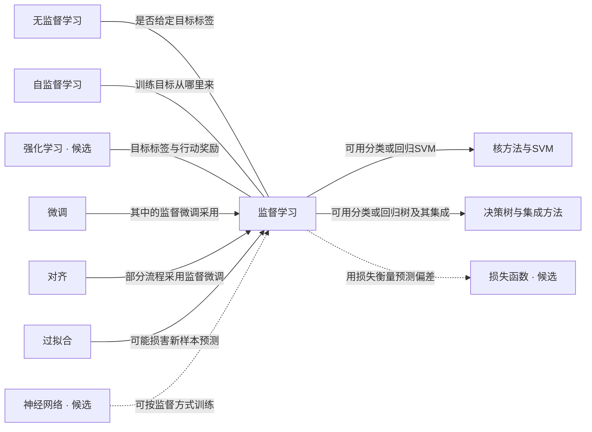

# 监督学习关系设计提案 v1

日期：2026-09-10。状态：供用户评阅，未应用到网站。

这是任务8、9的关系设计材料，不是 Stage 2 理解页审核、L3结论或发布许可。不修改正式图谱、理解页和既有审核记录。证据核查与教学取舍分列；教学效果尚未经过读者测试。

## 核查范围与快照

读取当前浏览器图谱 data/graph.js：SHA-256 `5100738023f32af68f6d6fe1628f17c284cd8ec5191f4383acb58950219310b7`。

监督学习有7条直接边。全部关系类型开启时，这8个节点的局部图还含4条邻居之间的边，共11条；直接边审查不能代表整个局部图全部完成。

现有边记录提供 from、to、type、label，没有逐边来源、适用条件或选取理由。这说明当前记录不足以追溯依据，并不能证明历史上没有依据。此次没有核查历史作者的全部工作记录。

## 可复用的准入标准

1. **一句完整命题**：A与B之间必须能写成明确事实。仅“都属于AI”“常同时出现”不够。
2. **范围一致**：不能用A的一种做法证明整个A属于B。条件必须进入对用户可见的说明，不能只藏在内部记录。
3. **可定位证据**：教材、官方课程、原始研究或可信综述的具体小节支持命题。网站可访问不等于事实已证实；提出反例时同步记录。
4. **关系类型匹配**：分类、组成、使用、对比、限制等不能互相替代。“是一种”需要端点在语义上能直接作包含判断。
5. **独立教学价值**：写出这条边帮助初学者回答的问题。事实成立但间接、重复的关系，可以不纳入当前概念图；不能为凑数量连线。
6. **不自动传递**：A使用B且B使用C，不推出A必须直接连接C。所有新增边逐条说明价值。
7. **不设任意数量上限**：审定的关系全部可见；以证据与必要性控制数量，不由布局容量决定真假。
8. **变更后重新核查**：端点标题、定义、关系类型或条件改变时，原结论不能直接复用。

建议记录字段：端点ID、原类型/标签、完整命题、适用条件、建议类型/方向/标签、证据URL及小节、反例、教学价值、事实结论、教学建议、核查日期和图谱快照。证据不足保持待定，不硬凑“通过”。

### 方向约定（设计建议，未改现有schema）

| 类型 | 箭头读法 | 使用边界 |
|---|---|---|
| is-a | 具体类别 → 上位类别 | 不用于“有时使用”或“其中一种方法” |
| part-of | 部件 → 整体 | 不代表推荐学习顺序 |
| uses | 使用者/过程 → 所用方法 | 必须限定可选方法、具体阶段或适用场景 |
| contrast | A — B，无箭头 | 明示同一个比较维度，不暗示谁更高级 |
| constrains / threatens | 限制或风险 → 受影响对象 | 说明可能影响什么，不写无依据的固定上限 |
| mitigates | 缓解方法 → 问题 | 不写成保证解决 |
| prerequisite | 必要前置 → 学习目标 | 单独举证教学依赖；仅“建议先看”不足 |
| enables / variant-of / related | 本次没有审定新的通用使用规则 | 后续遇到时逐项定义，不把 related 当作规避审查的兜底 |

## 现有7条直接关系

### 1. 自监督学习 — 监督学习

- 原记录：self-supervised-learning → supervised-learning；contrast；“绕开标注瓶颈”。contrast 在数据中无方向。
- 事实：自监督从数据本身构造训练信号；通常所说的监督学习使用给定的目标标签。见[S1](https://developers.google.com/machine-learning/intro-to-ml/supervised)和[S2](https://arxiv.org/abs/2006.08218)摘要。
- 边界：不宣称监督标签都必须人工编写，也不宣称自监督完全不需要数据治理或下游标签；不同分类体系对二者包含关系有不同用语。
- 建议：**保留对比，改说明为“训练目标从哪里来”**；无箭头。展开解释为“给定目标标签 / 从数据自身构造目标”。
- 教学价值：帮助区分训练信号来源，不让新手把自监督理解成完全没有学习目标。
- 结论：限定后的对比有依据；旧标签强调收益，未说清比较维度。

### 2. 对齐 → 监督学习

- 原记录：alignment → supervised-learning；uses；“SFT 阶段”。
- 事实：[S3](https://arxiv.org/abs/2203.02155)摘要及方法部分以人工示范进行监督微调，再使用偏好反馈训练。这支持对齐的一种具体路径，不代表所有对齐方法都需要SFT。
- 建议：**保留 uses，说明改为“部分对齐流程采用监督微调”**。方向表示流程采用方法，不是“监督学习能保证对齐”。
- 教学价值：连接学习范式与大模型训练，属于应用拓展。
- 结论：有条件成立。当前“SFT阶段”需解释且补上“部分流程”。

### 3. 决策树与集成方法 → 监督学习

- 原记录：decision-tree → supervised-learning；is-a；空标签。
- 事实：[S4](https://scikit-learn.org/stable/modules/tree.html)开篇、Classification、Regression明确支持分类树和回归树作为监督学习方法。
- 边界：当前节点标题还包含宽泛的“集成方法”，该来源不能证明标题覆盖的所有方法都属于监督学习。模型结构与学习范式也应区分。
- 补充证据：[S14](https://scikit-learn.org/stable/modules/ensemble.html)1.11.1及1.11.2支持梯度提升树、随机森林用于分类/回归，但不把所有集成技术都定义为监督学习。
- 建议：**保留端点，取消无条件 is-a**。可用“监督学习 → 决策树与集成方法”的 uses，标签“可用分类/回归树及其集成”。这里的集成限定为分类/回归树的集成。
- 教学价值：提供监督学习的具体方法例子。
- 结论：分类/回归树及其常见集成已有依据；整个复合标题的无条件分类关系不可直接通过。

### 4. 过拟合 → 监督学习

- 原记录：overfitting → supervised-learning；constrains；“泛化上限”。
- 事实：[S5](https://developers.google.com/machine-learning/crash-course/overfitting/overfitting)“Fitting, overfitting, and underfitting”描述训练表现好、未见数据表现差的现象。
- 建议：**保留 constrains，改说明为“可能损害对新样本的预测”**。方向表示风险作用于学习结果，不表示监督学习特有问题。
- 教学价值：解释为什么训练时做对不等于真正学会。
- 结论：关系有依据，但“泛化上限”容易被误读成固定、可量化的天花板，来源不支持这种强表述。

### 5. 监督学习 — 无监督学习

- 原记录：supervised-learning → unsupervised-learning；contrast；“要不要标注”。
- 事实：[S6](https://developers.google.com/machine-learning/intro-to-ml/what-is-ml)“Unsupervised learning”及理解检查以给定答案预测和无给定答案的结构发现作比较。
- 建议：**保留 contrast，说明改为“是否给定目标标签”**，无箭头。不要扩展成“无监督没有优化目标或评价办法”。
- 教学价值：区分预测任务与结构发现，避免把聚类与分类混淆。
- 结论：关系成立；标签精确化。

### 6. 微调 → 监督学习

- 原记录：fine-tuning → supervised-learning；is-a；“SFT”。
- 事实：[S3](https://arxiv.org/abs/2203.02155)同时使用监督微调与后续强化学习微调，足以反驳“所有微调都是监督学习”。
- 建议：**去掉这条无条件 is-a，保留两个节点的有条件联系**：fine-tuning → supervised-learning，uses，标签“监督微调（SFT）采用此方式”。不新增正式SFT节点。
- 教学价值：区分“继续训练的阶段/操作”和“采用的学习方式”。
- 结论：原分类命题范围过大，必须修改；标签缩写不能修复类型本身的误导。

### 7. 核方法与SVM → 监督学习

- 原记录：kernel-methods → supervised-learning；is-a；“经典分类器”。
- 事实：[S7](https://scikit-learn.org/stable/modules/svm.html)Classification和Regression支持SVC/SVR；[S8](https://scikit-learn.org/stable/api/sklearn.svm.html)列有无监督的OneClassSVM；[S9](https://scikit-learn.org/stable/modules/decomposition.html#kernel-pca)2.5.2.1展示核方法用于非线性降维。
- 建议：**去掉宽泛 is-a**，可改为supervised-learning → kernel-methods，uses，标签“可用SVM做分类或回归”。
- 教学价值：展示方法选择，同时防止把所有核方法都当成分类器。
- 结论：限定到分类/回归SVM成立；整个复合节点的无条件分类不成立。

## 缺失关系与候选优先级

以下优先级是教学设计建议，不是来源直接给出的排名，也不是穷尽所有可能关系。

| 候选 | 事实与来源定位 | 建议 |
|---|---|---|
| 监督学习 → 损失函数 | [S10](https://developers.google.com/machine-learning/crash-course/linear-regression/loss)“Loss”展示如何比较预测与标签 | 优先补充；uses“用损失衡量预测偏差”。说明是常见训练框架，不声称所有方法用同一损失或优化程序 |
| 神经网络 → 监督学习 | [S11](https://scikit-learn.org/stable/modules/neural_networks_supervised.html)开篇和分类/回归示例 | 优先补充；uses“可按监督方式训练”。不使用 is-a，不暗示网络只能用于监督学习 |
| 监督学习 — 强化学习 | [S6](https://developers.google.com/machine-learning/intro-to-ml/what-is-ml)“Reinforcement learning” | 建议补充对比“目标标签与行动奖励”；不简化成强化学习完全没有监督信号 |
| 监督学习 → 梯度下降 | [S12](https://scikit-learn.org/stable/modules/sgd.html)开篇、说明SGD是优化技术；[S4](https://scikit-learn.org/stable/modules/tree.html)说明树的贪心构建 | 可补充机制拓展，条件必须为“部分模型用它优化参数”，不是必要前置；不作为首轮必加项 |
| 正则化、训练数据治理、数据漂移 | 概念层面可能相关，但本轮没有逐条完成该项目节点范围与来源核对 | 暂不提出正式入图结论，不因名字相关直接连线 |

更基础的缺口：当前没有独立的“目标标签/标注数据”“分类与回归”“训练、验证、测试/泛化评估”节点。它们分别回答“拿什么学、预测什么、怎样判断学会”，比再加若干高级应用关系更优先。见[S1](https://developers.google.com/machine-learning/intro-to-ml/supervised)基础概念和[S13](https://scikit-learn.org/stable/modules/cross_validation.html)开篇关于未见数据评估的说明。这里只登记内容缺口；如何呈现、是否新增节点另行确定，不改页面排版或基础页正文。

## 关系图草案（含条件，不是布局或UI改版）

草案只表达中心直接关系，未画出其余邻居间连线，不表示授权删去它们；虚线表示候选，方向是命题方向。正式UI继续遵循用户现有节点与连接线样式。

## 上线前尚需处理

1. 用户确认上述准入标准及教学取舍，所有条件必须在最终关系说明中可见。
2. 邻居之间4条边另行核查：对齐→微调（uses，SFT+偏好优化）；自监督→无监督（variant-of，有明确目标）；过拟合→微调（threatens，小数据微调易过拟合）；核方法—决策树（contrast，两大经典分类器）。尤其自监督的分类体系与“经典分类器”概括不能直接沿用。
3. 基础页 relationsOf/openDetail 对所有记录按from/to生成箭头，未检查关系类型的directed。contrast在图谱里明确为false，但列表仍显示方向，需单独修复。此次未修改代码。
4. 不将本次外部证据核查表述为已完成全站来源追溯，也不声称真实读者效果已验证。
5. 正式图谱和理解页的后续修改必须使用项目允许的控制器流程；本提案不绕过权限，也不声称控制器已支持任何尚未核实的边编辑操作。
